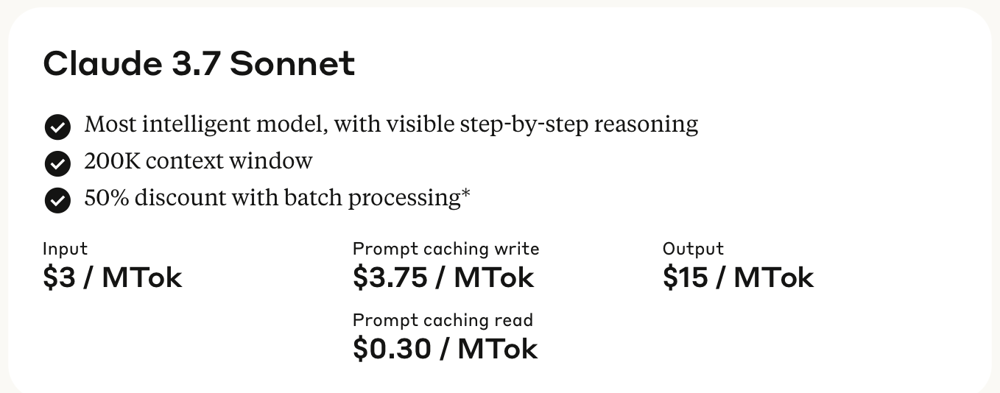

Here we go again, Anthropic are back at it, roughly 4 months after [their last announcement](https://www.anthropic.com/news/3-5-models-and-computer-use) of Claude 3.5 v2, they've just released Claude 3.7, which raises the immediate question. Why didn't they just name Claude 3.5 v2, 3.6 ..... AI firms [odd naming conventions (or lack of)](https://venturebeat.com/ai/too-many-models-too-much-confusion-openai-pledges-to-simplify-its-product-line/) aside, here's the highlights I've found so far.

> Note: This is basically a first reaction, none of this is really confirmed until it's tested so we're taking the announcement at it's word.

## Quick Links

### [Claude 3.7 Sonnet and Claude Code](https://www.anthropic.com/news/claude-3-7-sonnet)

The main announcement post.

### [Claude’s extended thinking](https://www.anthropic.com/news/visible-extended-thinking)

A breakdown of the new "Extended thinking" mode for Claude 3.7, including how it works, how they built it, their testing methods and safety and security information.

### [Claude 3.7 Sonnet's Model Card](https://assets.anthropic.com/m/785e231869ea8b3b/original/claude-3-7-sonnet-system-card.pdf)

The model card for Claude 3.7 Sonnet, includes, deeper details on the model, test results, safety and security information.

## Chain 'dem Thoughts

This model can think! Well as much as any model can "think", joining the likes of OpenAI's o series, Google Gemini 2.0 Thinking and DeepSeek R1, Claude can now spend some time (and tokens) "thinking" about the problem presented to it before responding to the query.

> Essentially everyone got the best results from old models by telling them to "think step by step" and all the model companies realised so baked it straight in to the model as a feature.

Anthropic have been quite open and realistic when describing thinking mode in the [Claude’s extended thinking](https://www.anthropic.com/news/visible-extended-thinking) post, what's notable is the thinking mode is not as [aligned](https://en.wikipedia.org/wiki/AI_alignment) as the standard output is, meaning it's going to be less personal/professional/etc. and could go off track more easily.

This also means it's less likely to hide information, as proven immediately when I tested the model on [claude.ai](https://claude.ai)

Since the thinking space is for working out what to do naturally the model will talk about it's instructions, so early warning, maybe don't expose this to your users.

Having full access to a free thinking mode in a major model like this seems like a really powerful debugging tool to me, the previous chain of thought method had the disadvantage of being tied in all the same system prompt and model alignment rules the rest of the response would be using while also normally trying to hide the system prompt from the user, now though we have a space it'll be plain and straightforward in what it's "saying" before all the heavy alignment kicks in.

## Claude Code

The other main announcement was [Claude Code](https://www.anthropic.com/news/claude-3-7-sonnet), Anthropic's attempt at an agentic coding tool. It's a CLI based assistant like tool that can act on your behalf opening and editing files and running commands, it reminds me a lot of the VS Code extension [Cline](https://marketplace.visualstudio.com/items?itemName=saoudrizwan.claude-dev) (which no doubt is about to get even better with Claude 3.7)  

A quick look through the [docs](https://docs.anthropic.com/en/docs/agents-and-tools/claude-code/overview) it supports [MCP](https://modelcontextprotocol.io/introduction) which is nice and the power users already with an MCP setup on their machines are going to love it, and has a bunch of commands and agents already. I really appreciate the inclusion of a `/costs` command since the combo of the new thinking mode and a recursive task to do will lead to a big bill in no time!

## Pricing

Neutral news here I suppose, Claude 3.7 Sonnet is priced the same as 3.6, at $3/million tokens for input and $15/m output.

It'd be nice to see these start to go down again but I think at this point we're going to need a hardware or software architecture breakthrough for that. (I'm expecting some sort of software architecture updates soon, [Google have been working on replacing the T in GPT replacing transformers with titans](https://arxiv.org/abs/2501.00663))

## Testing

AI firms have many whacky and wild ways of testing their models, a classic one not seen as much recently is getting them to play video games, a big part of early OpenAI's benchmarks where based on [how well they played games](https://venturebeat.com/business/openai-launches-gym-a-toolkit-for-testing-and-comparing-reinforcement-learning-algorithms/) in their [Claude’s extended thinking](https://www.anthropic.com/news/visible-extended-thinking) post Anthropic show off my new favorite LLM test, how far can it get in Pokemon

Looking back it seems Claude 3.0 couldn't even get out of the first town in the game! and now 3.7 has made it all the way to the 3rd badge! That puts Claude 3.7 at roughly the same attention span I had at 5 years old, at this rate it'll be a teenager and to old for Pokemon games by Claude 4!

> For the people with lives, Pokemon has 8 gyms to complete and then a final challenge so it has a way to go.

And that's the round up, I might be back with more thoughts or experiments but I imagine Claude 4 will be out by then 😉
